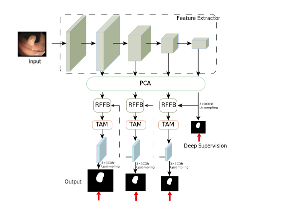

### CATNet: A Cross Attention and Texture-aware Network for polyp segmentation

by Zhifang Deng, Yangdong Wu.

#### 1.Framework Overview

#### 2.Results

#### 3.Usage

##### 3.1 Recommended environment:

##### 3.2 Data preparation

- downloading testing dataset and move it into `./data/TestDataset/`, which can be found in this [Google Drive Link (327.2MB)](https://drive.google.com/file/d/1Y2z7FD5p5y31vkZwQQomXFRB0HutHyao/view?usp=sharing). It contains five sub-datsets: CVC-300 (60 test samples), CVC-ClinicDB (62 test samples), CVC-ColonDB (380 test samples), ETIS-LaribPolypDB (196 test samples), Kvasir (100 test samples).
- downloading training dataset and move it into `./data/TrainDataset/`, which can be found in this [Google Drive Link (399.5MB)](https://drive.google.com/file/d/1YiGHLw4iTvKdvbT6MgwO9zcCv8zJ_Bnb/view?usp=sharing). It contains two sub-datasets: Kvasir-SEG (900 train samples) and CVC-ClinicDB (550 train samples).

- downloading Res2Net weights [Google Drive (98.4MB)](https://drive.google.com/file/d/1FjXh_YG1hLGPPM6j-c8UxHcIWtzGGau5/view?usp=sharing),  and then put it in the './pretrained_pth' folder for initialization.
- downloading PVT weights [Google Drive](https://drive.google.com/drive/folders/1Eu8v9vMRvt-dyCH0XSV2i77lAd62nPXV?usp=sharing),  and then put it in the './pretrained_pth' folder for initialization.
##### 3.3 Training Configuration

- Assigning your costumed path, like `--save_path`in `mytrain.py`and '`mytrain_p.py`

- `mytrain.py` is used for CATN_R, and `mytrain_p.py` is used for CATN_P. 

##### 3.4 Testing Configuration

- After you download all the pre-trained model and testing dataset, just run `MyTesting.py`or `MyTesting_p.py` to generate the final prediction map.
##### 3.5 Evaluating your trained model
- Matlab: One-key evaluation is written in MATLAB code ([Google Drive Link](https://drive.google.com/file/d/1eKUpny19kLaCpZl7jjan408238h5PGIO/view?usp=sharing)), please follow this the instructions in `./eval/main.m` and just run it to generate the evaluation results in `./res/`. The complete evaluation toolbox (including data, map, eval code, and res): [Google Drive Link (380.6MB)](https://drive.google.com/file/d/1FJxb9DZMzPWFffkbchU0s9Zcf5oe7qcT/view?usp=sharing).
- Python: Please refer to the work of ACMMM2021 ([link](https://github.com/plemeri/UACANet)).
- Please note that we use the Matlab version to evaluate in our paper.

##### 3.6 Well trained model

You could download the trained model from [Google Drive](https://drive.google.com/file/d/1OIS69FLNXImCmpCxml2Fzy0N1ICgL0mX/view?usp=sharing)and put the model in directory './model_pth'.

##### 3.7 Pre-computed maps

CATN_R [Google Drive](https://drive.google.com/file/d/1oFwgk4KPmMdPzufHbVGdM-1DnpWIRVzz/view?usp=sharing)

CATN_P [Google Drive](https://drive.google.com/file/d/1o8APlpAz2yI0eFTZUNr960aTYfapKgPf/view?usp=sharing)

#### 4. Acknowledgement

We are extremely grateful for the following outstanding work: Polyp-PVT, TANet, ECA-Net and Dual Cross-Attention (DCA), which have provided the basis for our framework.

#### 5. License

The source code is free for research and education use only. Any comercial use should get formal permission first.